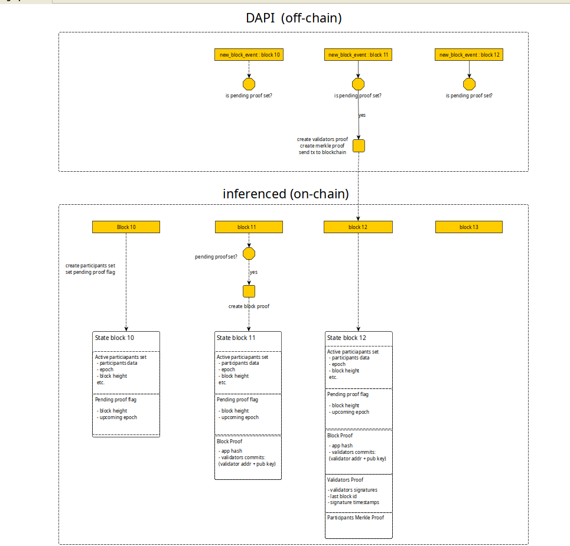

# Active Participants Verification Mechanism

## Context
When a new node joins the network, bootstrap peers are always required.  
This introduces a **centralization risk**: whoever hosts these peers effectively gains:
- A monopoly on providing the up-to-date state for new peers.
- A monopoly on providing the set of active participants to developers who contribute compute power for inference/training in the current epoch.

This creates opportunities for abuse.

To prevent this and minimize the need to trust the current active participants, we propose a **verification mechanism** that traces the evolution of the active participants set from the genesis epoch to the current epoch, proving that the current set was formed as a result of correct protocol execution.

## Verification Requirements
The verification mechanism must confirm two aspects:

1. **Existence**:  
   The specific active participants set that is claimed to have been created at block height `N` must indeed exist in the state at that height.

2. **Continuity**:  
   The current active participants set must (at least partially) derive from the previous epoch’s set.  
   Since only participants with non-zero weight may vote, the previous set must have signed the block in which the current set was created.  
   Therefore, at least some of them must also appear in the current set.

By performing these checks from the current epoch back to the genesis epoch, and knowing the genesis block app hash, we can prove that the chain of active participants is valid and trustworthy.

## Technical Solution
To implement the verification mechanism, three proofs are required:

### 1. Active Participants Merkle Proof
- Proves that the active participants set associated with block height `N` exists in the state at that height.
- Can be computed by sending an RPC request to a blockchain node.  
  However, this requires the node to have **all states and blocks** (no snapshot sync).
- To address this, each network node should compute the proof immediately once the set is created and store it **on-chain**, so that it becomes part of the state and can be accessed even by snapshot-synced nodes.

**Required for verification:**
- The active participants set in byte representation.
- The app hash recorded in the header of the next block after commit phase.

> This proof is generated by the **decentralized-api node**, since blockchain nodes should not issue RPC requests to themselves.

### 2. Validators Proof
- Proves that a specific validator set (the current active participants set) signed the block in which the upcoming epoch’s active participants set was created.
- Includes:
    - Validator signatures
    - Timestamps
    - Block ID
    - Block height
    - Round
    - Validator addresses

> Generated by the **decentralized-api node** and stored on-chain, same as the Active Participants Merkle Proof.

### 3. Block Proof
- Created and stored on-chain from commit info at block height `N+1`, right after the new active participants set is created at height `N`.
- Serves as the **link** between:
    - Active Participants Merkle Proof
    - Validators Proof
    - The active participants set itself

## Additional Considerations
1. **Active Participants Merkle Proof Verification**:  
   Requires the app hash, which must be stored on-chain alongside the proof due to snapshot sync issues.

2. **Validator Signatures Verification**:  
   Requires the validator’s consensus public key, which cannot be obtained from the last commit of the block.

3. **Validator-to-Participant Link**:  
   The participant entity contains the validator’s consensus public key, allowing us to match block validators with active participants.

## Conclusion
By combining the above proofs and linking information, we can **cryptographically verify the chain of active participants** from the current epoch back to the genesis epoch, ensuring its correctness and trustworthiness.

